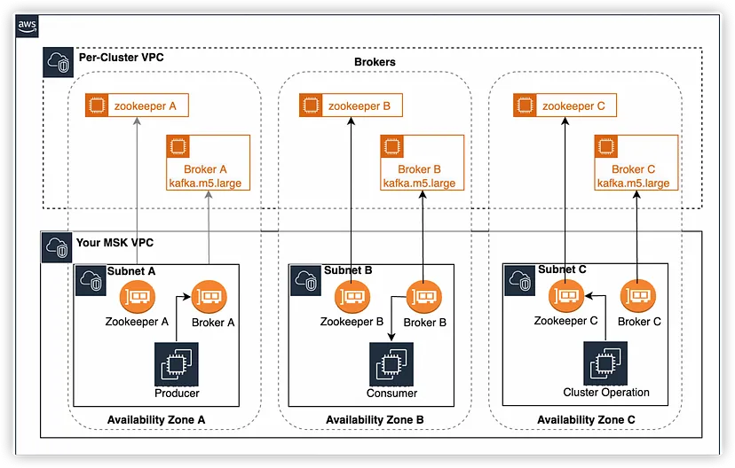
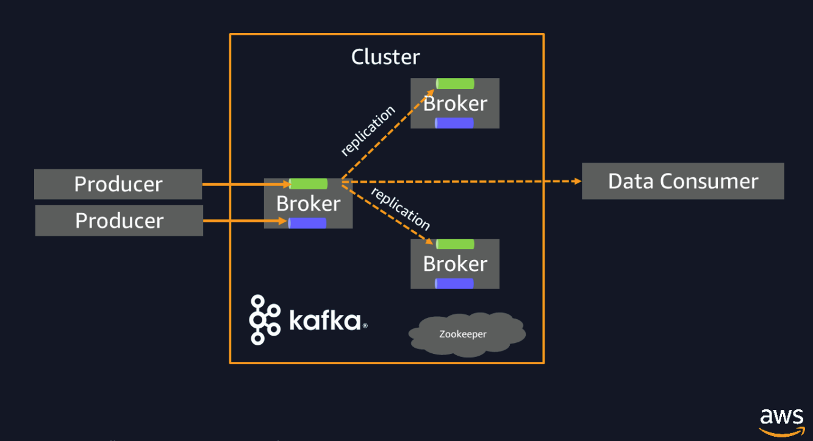
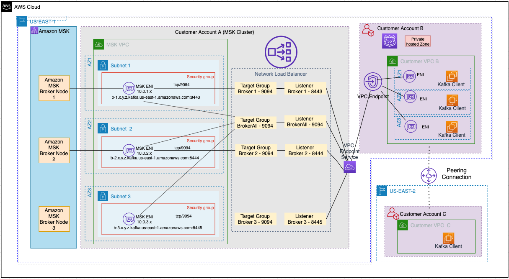
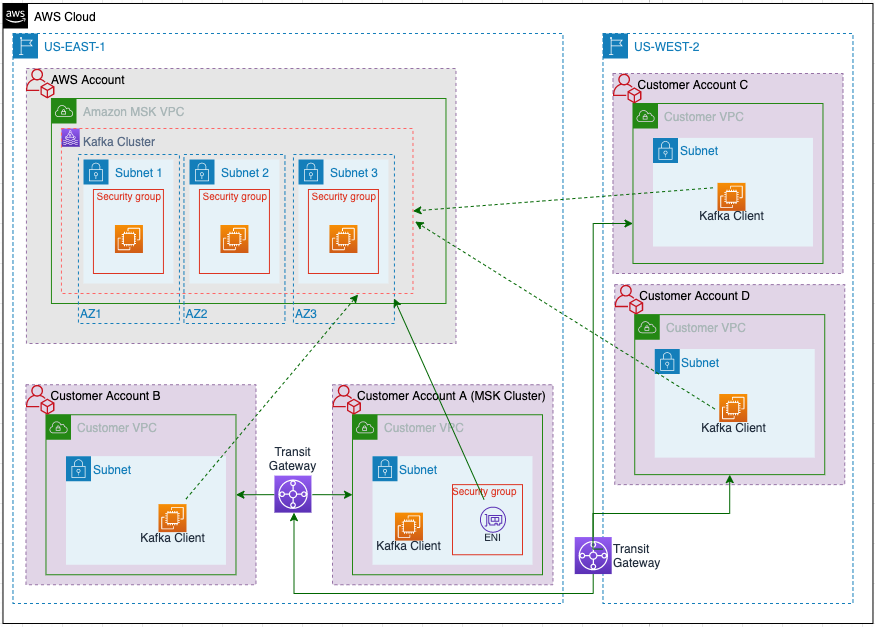
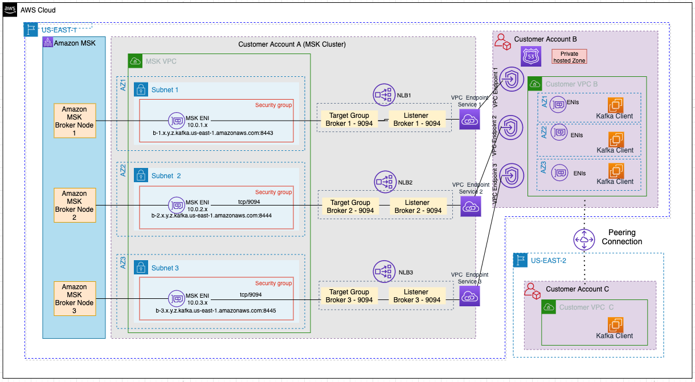

## 👨‍🎓 1. AWS D2E  
- 콜드 핫 스토리지
  - https://docs.aws.amazon.com/ko_kr/opensearch-service/latest/developerguide/cold-storage.html
- 오픈서치 데이터 관리 비용
- 데이터 존 : 데이터 활용 관련 구독을 통해 아테나 등 전달 - 출시예정
  - https://aws.amazon.com/ko/datazone/
- 아파치 에어플로우 : DAG 등
  - https://aws.amazon.com/ko/blogs/korea/introducing-amazon-managed-workflows-for-apache-airflow-mwaa/
- 클린룸
  - https://aws.amazon.com/ko/clean-rooms/
- Glue : 데이터 카탈로그와 ETL, 크롤링 및 메타데이터를 통한 카탈로그화 - 변경사항 별 버전 관리 가능, 아파치 하이브 기반
  - 데이터 소스 들로부터 카탈로그 분류를 하여 데이터 웨어하우스로 전달하기 위한 느낌
  - ETL 에 UI 를 사용한 부분이 있는데 그걸 추가한 경우 코드로 변환가능해서 수정하는게 좋음
  - 데이터 브루는 데이터 프로파일 관련한 시각화 등 제공 (상관관계 등)
  - 글루 스튜디오 노트북 사용 가능
  - 글루 포 레이는 분산 학습 가능
  - 퀄리티를 통해 데이터 품질 관리 가능
  - https://aws.amazon.com/ko/glue/
- 키네시스 : 데이터 스트림, 파이어 호스, 비디오 스트림 등으로 구성
  - 데이터 스트림은 샤드로 구분 될 수 있다
  - 파이어호스는 Parquet ORC 등 데이터 변환 가능, 중복 필터링 등
  - https://aws.amazon.com/ko/kinesis/
- 아테나 : S3 쿼리를 돌린 결과를 소스로 하여 사용 가능
  - JDBC, ODBC 제공
  - 그룹별 권한 정책 지정 및 격리 가능
  - Federated Query : 람다를 통해 온프레미스 또는 클라우드에서 연합 쿼리 가능
  - 쿼리 결과는 setting 에 지정한 s3 에 자동저장됨
  - parquet 형식을 이용해서 비용 절감 가능
  - 해당 데이터 소스들을 바탕으로 sage maker 등 활용 가능
  - https://aws.amazon.com/ko/athena/
- QuickSight : ML 기반 이상감지 등이 있고 앱 임베드도 지원
- https://catalog.workshops.aws/introduction-to-analytics-on-aws/ko-KR/lab-guide/ingest
- https://aws.amazon.com/ko/blogs/big-data/simplify-querying-nested-json-with-the-aws-glue-relationalize-transform/
- https://aws.amazon.com/ko/blogs/big-data/simplify-semi-structured-nested-json-data-analysis-with-aws-glue-databrew-and-amazon-quicksight/
- https://catalog.workshops.aws/aws-data-ingestion-pipeline/ko-KR
- https://catalog.us-east-1.prod.workshops.aws/workshops/19701223-0bf3-4273-a75a-209aa242f8a8/ko-KR/

## 👨‍🎓 2. AWS CDK  
- S3 데이터 ingestion to SQS , stable diffustion 사용 - 이미지를 text 로 만들어서 sage maker 로 전송 - S3 적재
- cdk 에서 iam role 부여가 메소드로 쉽게 가능
- CDK 는 Cloud formation 과 같이 떠있어서 Cloud formation 과 같다고 생각하면 됨
- 각 언어별로 개발 가능하고 cdk 실행 시 언어 옵션을 주면 됨
- 강점 : 서버리스 모두 가능, 컨테이너도 이제 모두 컨트롤 가능, CDK for Teraform 를 사용하여 CDK 로 던지면 Teraform 으로 바꿔서 던지기 때문에 버전 관리 등이 편함
- SAM 도 계속 발전되고 있음
- Cloud9 추가금 없이 EC2 접속 및 파일전송 등이 편함
- 람다를 도커에서 배포하기 위해서 dockerfile 에 CMD ["classifier.run"] 넣어서 하면 됨
- https://musma.github.io/2019/11/28/about-aws-cdk.html
- Git Ops ?
- https://github.com/kyopark2014/image-classification-api-server

## 👨‍🎓 3. AWS MWAA  
- 이벤트 기반 아키텍처를 구성했을 때 그 FLOW 에 대한 파악을 하기가 힘들 수 있음
  - Choreography : event 흐름으로 워크플로우 파악
  - Ochestration : 이벤트 기반의 워크플로우를 모니터링 관리하기 위해서 Airflow 를 사용 가능
    - 1세대에는 프로그래밍으로 했고 DAG 가 특징
- Airflow 의 대표 사례는 ETL > AI/ML > DevOps 로 관리할 수 있는게 있으나 Devops 까지는 쉽지 않음
- DAG 디렉토리는 파이썬으로 코딩한 Work flow 이다
- 컴포넌트 네개 : 워커/스케쥴러/데이터베이스/웹서비스
- Task 는 오퍼레이터로 만들 수 있는데 DAG 에 추가되는 Job 이며 여러가지 수행 Operator 를 통해 만들 수 있다
  - 어느 DAG 에서 수행할지 지정해주어야 한다
- DAG 는 오브젝트
- copy_data >> clean_data 와 같은 식으로 각 task 의 work flow 를 지정하거나 함수기반으로도 지정은 할 수 있다
- DAG 는 스케쥴링을 할 수 있고 크론탭 형식으로 작성한다
- Worker 의 경우에도 스케일링이 필요하다
- 스케쥴러 워커는 커스터머 VPC, DB 랑 Web server 는 서비스 VPC
- MWAA 의 경우에는 Fargate 기반으로 내부에 크론탭 기반으로 동작을 하기 때문에 Stop 하여 비용을 절감하는 방법은 사용할 수 없다
  - 즉, Worker DB 등 기본 비용이 들기 때문에 한달에 한번 정도 실행되거나 하는 경우에는 Step function 을 사용하는 것이 낫다
  - MWAA 의 경우에는 외부 이벤트 주입 방식이 아니기 때문이다
- Create 버튼을 누르면 시간이 꽤 소요되고 이후에 Web server UI 로 조회할 수 있다
- Code builder (Git 연동) 와 S3 를 이용해 배포 자동화를 할 수 있다
- Step function 의 경우에도 Operator 로 지원한다
- 초기 비용은 워커 기본 1개, 기본 스케쥴러 2개 워커는 25개 스케쥴러는 5개 까지 비용이 늘어나며 기본 DB 비용도 소요된다
- Step function 은 AWS 내부적으로 만든 것이라 AWS 서비스 들과 Integration 이 좀 더 유연하고 효과적임
- Airflow 는 오픈소스 기반으로 만듦

## 👨‍🎓 4. AWS MSK  
- Amazon MSK란 Amazon Managed Streaming for Apache Kafka(Amazon MSK)로 Apache Kafka를 사용하여 스트리밍 데이터를 처리하는 애플리케이션의 구축 및 실행을 위해 사용할 수 있는 완전관리형 서비스
 (Image from aws) 
- MSK 구성요소
1. Broker
   - Amazon MSK 클러스터를 생성할 때 Amazon MSK가 각 가용 영역에 생성할 브로커 노드 수를 지정
   클러스터에는 가용 영역당 하나의 브로커가 있습니다. 각 가용 영역에는 고유한 virtual private cloud(VPC) 서브넷 존재
2. ZooKeeper 
   - 아파치 ZooKeeper 는 안정성이 뛰어나고 분산 조정을 지원하는 오픈 소스 서버
   - 주 역할은 분산 시스템의 메타 정보를 관리하고, 필요시에는 분산 시스템의 마스터를 선출
3. Producers, Consumers, and Topic Creators 
   - Amazon MSK를 사용하면 Apache Kafka 데이터 영역 작업을 사용하여 Topic을 만들고, 데이터를 생산하고 소비
* 비용 비교 : https://techblog.gccompany.co.kr/aws-msk-part1-msk-%EB%8F%84%EC%9E%85-%EC%97%AC%EC%A0%95-b000cbea5c02
- 인스턴스 타입 m5.large 기준으로 보면 EC2 3대로 구축하는 경우보다 MSK로 구축 시 약 2배 정도 비용 소요되지만 ec2 는 인스턴스 간 데이터 복제 비용이 드는 반면 MSK 는 이러한 비용은 소모되지 않음
- 구축과정 참고 : https://techblog.gccompany.co.kr/aws-msk-part2-msk-%ED%81%B4%EB%9F%AC%EC%8A%A4%ED%84%B0%EB%A5%BC-%EA%B5%AC%EC%B6%95%ED%95%B4%EB%B3%BC%EA%B9%8C%EC%9A%94-8722c79d9041
- 카프카 클러스터는 모든 브로커가 클라이언트의 요청을 처리할 수 있는 Peer-to-Peer(p2p) 구조를 가짐
- 실제로 메시지를 전달받고 저장하는 단위인 파티션은 리더와 팔로워로 나뉘어 작업을 처리
- 즉, 하나의 토픽이라도 리더 파티션의 위치에 따라 여러 브로커가 요청 받을 수 있음
- MSK 는 주키퍼 서버 운영은 하지 않아도 되는 반면에 가용영역 당 브로커수를 조절하는 것은 안된다
- 토픽에서 파티션은 늘릴 수만 있고 줄일 수는 없기 때문에 이러한 설정을 잘해주어야 한다
- AWS MSK 공식 문서 : https://docs.aws.amazon.com/ko_kr/msk/latest/developerguide/getting-started.html
   (Image from aws) 
- 토픽의 파티션 개수와 컨슈머 그룹 관련 설정 참고 : https://www.popit.kr/kafka-consumer-group/
- 기본 카프카 명령어 참고 : https://veneas.tistory.com/entry/Kafka-%EA%B8%B0%EB%B3%B8-%EC%B9%B4%ED%94%84%EC%B9%B4-%EB%AA%85%EB%A0%B9%EC%96%B4-command-line-tool

## 👨‍🎓 5. 보안 패턴  
- Private Link 란 ?
   (Image from aws) 
- https://docs.aws.amazon.com/vpc/latest/privatelink/what-is-privatelink.html
- AWS 람다와 MSK 를 함께 사용하기 위한 방법으로 Nat gateway 와 Private Link 가 있으며 Private Link 를 사용하기 위해서는 람다의 엔드포인트 (+ 시크릿 매니저, sts) 가 필요
- https://aws.amazon.com/ko/blogs/compute/setting-up-aws-lambda-with-an-apache-kafka-cluster-within-a-vpc/
- MSK 보안 패턴
1. Amazon VPC peering
2. AWS Transit Gateway
3. AWS PrivateLink
 (Image from aws) 

- 보안 패턴 1
   (Image from aws) 

- 보안 패턴 2
   (Image from aws) 

- 보안 패턴 3-1
   (Image from aws) 
- The NLB has a separate listener for each MSK broker. Because this pattern has a single NLB endpoint, each of the listeners need to listen on unique port. In the preceding diagram, the ports are depicted as 8443, 8444, and 8445.

- 보안 패턴 3-2
   (Image from aws) 
- These patterns have the following benefits:
1. They are scalable solutions and do not limit the number of consumer VPCs.
2. AWS PrivateLink allows for VPC CIDR ranges to overlap.
3. You don’t need path definitions or a route table (access only to the MSK cluster), therefore it’s easier to manage
- The drawbacks are as follows:
1. The VPC endpoint and service must be in the same Region.
2. The VPC endpoints support IPv4 traffic only.
3. The endpoints can’t be transferred from one VPC to another.

* 구축 시 조심해야할 팁
1. B VPC 람다 아웃바운드 - A VPC
2. msk 인바운드 - B VPC
3. 보안그룹 설정 (MSK, Lambda, Endpoint, NLB, Secret manager, STS)
4. IAM 설정 (직접 구축 시와 Lambda trigger 시에 다르며 이는 인바운드 호출 방식 과 아웃바운드 호출 방식으로 다르다)
5. 서브넷 라우팅 테이블 설정