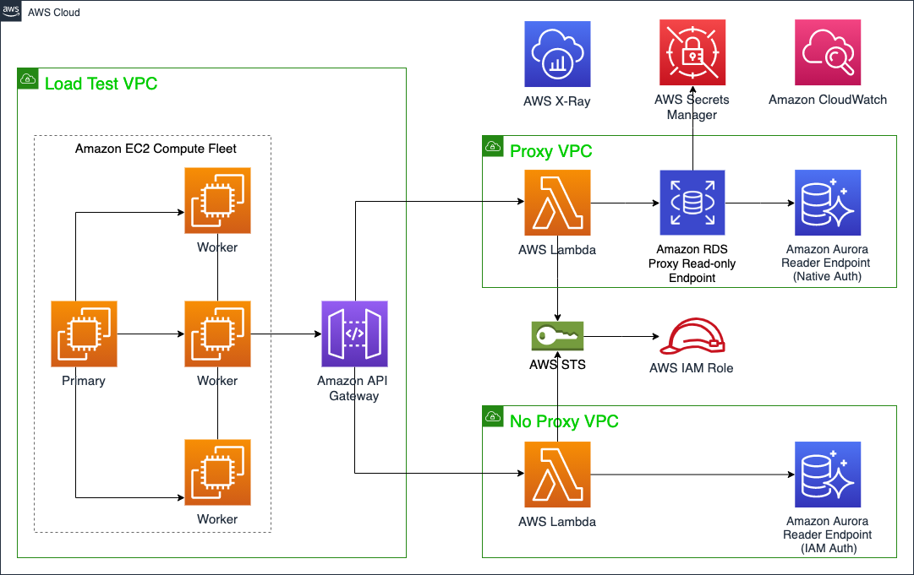

# 👨‍🎓 AWS RDS Proxy  
- [RDS PROXY 란](https://docs.aws.amazon.com/ko_kr/AmazonRDS/latest/UserGuide/rds-proxy.html)
- [RDS PROXY 개념](https://docs.aws.amazon.com/ko_kr/AmazonRDS/latest/UserGuide/rds-proxy.howitworks.html)
    Image from aws  

## Amazon RDS Proxy를 사용하여 멀티 테넌트 SaaS 데이터베이스 프록시 솔루션 구축 및 로드 테스트  
- Amazon RDS Proxy는 애플리케이션의 확장성, 보안 및 데이터베이스 장애에 대한 탄력성을 향상시키는 완벽하게 관리되는 고가용성 데이터베이스 프록시입니다. 데이터베이스 연결을 풀링 및 공유하여 확장성을 향상시키고 AWS IAM(Identity and Access Management) 인증 및 AWS Secrets Manager를 사용하여 보안을 개선하는 첫 번째 두 가지 이점에 중점을 둡니다. Amazon Aurora 복제본에 연결되는 RDS 프록시 엔드포인트도 사용합니다. 제공된 솔루션은 Amazon Aurora MySQL-Compatible Edition과 함께 멀티 테넌시(Multi-tenancy)를 사용하지만 MySQL 및 Postgre를 사용하여 단일 및 멀티 테넌시(Multi-tenancy) 데이터베이스 모두에 RDS Proxy를 적용할 수 있습니다. Amazon RDS(Amazon RDS) 및 Aurora에서 SQL을 사용할 수 있습니다.
1. Proxy VPC – 이 VPC에는 Lambda, RDS Proxy, Aurora 및 Secrets Manager 리소스에 연결되는 Amazon VPC 엔드포인트가 포함되어 있으며, 함께 규모에 맞게 멀티 테넌트 액세스 계층을 생성합니다. Node.js 또는 Python에서 테넌트 데이터 액세스를 처리하는 람다 액세스 기능이 포함되어 있습니다. AWS STS(AWS STS), IAM 역할 및 IAM 세션 정책은 각 테넌트에 대한 올바른 데이터베이스 또는 스키마를 결정하고 액세스를 제공하는 데 사용됩니다. Aurora 클러스터에는 로드 테스트에 사용되는 RDS Proxy 엔드포인트 뒤에 있는 작성기 1개와 Aurora 복제본(기본적으로 db.r5.large 인스턴스 클래스) 2개의 인스턴스가 포함됩니다.
2. No Proxy VPC – 이 VPC는 RDS Proxy 및 Secrets Manager가 없는 경우를 제외하고 Proxy VPC와 동일한 아키텍처입니다. 즉, 람다 함수는 RDS Proxy 엔드포인트가 아닌 Aurora 엔드포인트로 직접 호출합니다.
3. 로드 테스트 VPC – 이 VPC는 Locust 라는 오픈 소스 Python 분산 로드 테스트 도구를 사용합니다. 기본 작업자 구성의 Amazon Elastic Compute Cloud(Amazon EC2) 인스턴스에 설치되어 Proxy 및 No Proxy VPC에 동시 요청을 전송하므로 성능을 직접 비교할 수 있습니다. 이러한 인스턴스는 로드를 API 게이트웨이로 전송하고, API 게이트웨이는 요청을 Proxy 및 No Proxy VPC로 전달합니다.

## 연결 설정 구성 
- RDS 프록시의 연결 풀링을 조정하려면 다음 설정을 수정합니다. 
1. IdleClientTimeout 
2. MaxConnectionsPercent 
3. MaxIdleConnectionsPercent 
4. ConnectionBorrowTimeout 
    
### IdleClientTimeout 
프록시에 의해 종료되기 전에 클라이언트 연결이 유휴 상태일 수 있는 시간을 지정할 수 있습니다. 기본값은 1,800초(30분)입니다. 
애플리케이션이 이전 요청이 완료된 후 지정된 시간 내에 새 요청을 제출하지 않으면 클라이언트 연결이 유휴 상태로 간주됩니다. 기본 데이터베이스 연결은 열린 상태를 유지하고 연결 풀로 반환됩니다. 따라서 새 클라이언트 연결에 다시 사용할 수 있습니다. 프록시가 기간 경과 연결을 사전에 제거하도록 하려면 유휴 클라이언트 연결 제한 시간을 줄이는 것이 좋습니다. 워크로드가 프록시와 자주 연결하는 경우 연결 설정 비용을 절약하기 위해 유휴 클라이언트 연결 제한 시간을 늘리는 것이 좋습니다. 
이 설정은 RDS 콘솔의 유휴 클라이언트 연결 제한 시간(Idle client connection timeout) 필드와 AWS CLI 및 API의 IdleClientTimeout 설정으로 표시됩니다. RDS 콘솔에서 유휴 클라이언트 연결 제한 시간(Idle client connection timeout) 필드의 값을 변경하는 방법을 알아보려면 AWS Management Console 섹션을 참조하세요. IdleClientTimeout 설정의 값을 변경하는 방법을 알아보려면 CLI 명령 modify-db-proxy 또는 API 작업 ModifyDBProxy를 참조하세요. 
 
### MaxConnectionsPercent 
RDS 프록시가 대상 데이터베이스와 설정할 수 있는 연결 수를 제한할 수 있습니다. 데이터베이스에 사용할 수 있는 최대 연결의 백분율로 제한을 지정합니다. 이 설정은 RDS 콘솔의 연결 풀 최대 연결(Connection pool maximum connections) 필드와 AWS CLI 또는 API의 MaxConnectionsPercent 설정으로 표시됩니다. 
MaxConnectionsPercent 값은 대상 그룹에서 사용하는 RDS DB 인스턴스에 대한 max_connections 설정의 백분율로 표시됩니다. 프록시가 이러한 연결을 모두 미리 생성하지는 않습니다. 이 설정은 워크로드에서 필요로 할 때 프록시가 이러한 연결을 설정할 수 있는 권한을 보유합니다. 
예를 들어 등록된 데이터베이스 대상이 max_connections가 1000으로 설정되어 있고 MaxConnectionsPercent가 95로 설정된 경우, RDS 프록시는 950개의 연결을 해당 데이터베이스 대상에 대한 동시 연결의 상한선으로 설정합니다. 
워크로드가 허용된 최대 데이터베이스 연결 수에 도달할 경우 발생하는 일반적인 부작용은 전체 쿼리 지연 시간이 늘어나고, 그와 함께 DatabaseConnectionsBorrowLatency 지표도 증가한다는 점입니다. DatabaseConnections 및 MaxDatabaseConnectionsAllowed 지표를 비교하여 현재 사용된 데이터베이스 연결 수와 허용된 총 데이터베이스 연결 수를 모니터링할 수 있습니다. 
이 파라미터를 설정할 때는 다음과 같은 모범 사례를 고려하세요. 
워크로드 패턴의 변동에 대비하여 충분한 연결 여유 용량을 확보하세요. 파라미터를 최근에 모니터링한 최대 사용량보다 30% 이상 높게 설정하는 것이 좋습니다. RDS 프록시는 데이터베이스 연결 할당량을 여러 노드에 재분배하므로, 차용 지연 시간이 늘어나는 것을 방지하기 위해 내부 용량 변경 시 추가 연결을 위한 최소 30%의 여유 용량이 필요할 수 있습니다. 
RDS 프록시는 빠른 장애 조치, 트래픽 라우팅, 내부 작업을 지원하기 위해 활성 모니터링을 위한 특정 수의 연결을 예약합니다. MaxDatabaseConnectionsAllowed 지표에는 이러한 예약된 연결이 포함되지 않습니다. 이는 워크로드를 처리하는 데 사용 가능한 연결 수를 나타내며 MaxConnectionsPercent 설정에서 파생된 값보다 낮을 수 있습니다. 
최소 권장 MaxConnectionsPercent 값 
db.t3.small: 30 
db.t3.medium 이상: 20 
RDS 콘솔에서 연결 풀 최대 연결(Connection pool maximum connections) 필드의 값을 변경하는 방법을 알아보려면 AWS Management Console 섹션을 참조하세요. MaxConnectionsPercent 설정의 값을 변경하는 방법을 알아보려면 CLI 명령 modify-db-proxy-target-group 또는 API 작업 ModifyDBProxyTargetGroup을 참조하세요. 
데이터베이스 연결 한도에 대한 자세한 내용은 최대 데이터베이스 연결 수를 참조하세요. 
### MaxIdleConnectionsPercent 
RDS 프록시가 연결 풀에서 유지할 수 있는 유휴 데이터베이스 연결 수를 제어할 수 있습니다. RDS 프록시는 5분 동안 연결에 대한 활동이 없으면 풀의 데이터베이스 연결을 유휴 상태로 간주합니다. 
데이터베이스에 사용할 수 있는 최대 연결의 백분율로 제한을 지정합니다. 기본값은 MaxConnectionsPercent의 50%이고 상한은 MaxConnectionsPercent 값입니다. 값이 높으면 프록시가 유휴 데이터베이스 연결 비율을 높게 유지할 수 있습니다. 값이 낮으면 프록시가 높은 유휴 데이터베이스 연결 비율을 닫습니다. 워크로드를 예측할 수 없는 경우 MaxIdleConnectionsPercent에 높은 값을 설정하는 것을 고려해 보세요. 이렇게 하면 RDS 프록시가 새 데이터베이스 연결을 많이 열지 않고도 급증하는 활동을 수용할 수 있습니다. 
이 설정은 AWS CLI 또는 API에서 DBProxyTargetGroup의 MaxIdleConnectionsPercent 설정으로 표시됩니다. MaxIdleConnectionsPercent 설정의 값을 변경하는 방법을 알아보려면 CLI 명령 modify-db-proxy-target-group 또는 API 작업 ModifyDBProxyTargetGroup을 참조하세요. 
참고 
RDS 프록시는 더 이상 사용되지 않을 경우 24시간 후에 데이터베이스 연결을 닫습니다. 프록시는 최대 유휴 연결 설정 값에 관계없이 이 작업을 수행합니다. 
데이터베이스 연결 한도에 대한 자세한 내용은 최대 데이터베이스 연결 수를 참조하세요. 
### ConnectionBorrowTimeout 
시간 초과 오류를 반환하기 전에 RDS 프록시가 연결 풀의 데이터베이스 연결을 사용할 수 있을 때까지 기다리는 시간을 선택할 수 있습니다. 기본값은 120초입니다. 이 설정은 연결 수가 최대일 때, 즉 연결 풀에서 사용할 수 있는 연결이 없을 때 적용됩니다. 또한 예를 들어 장애 조치 작업이 진행 중이기 때문에 요청을 처리할 수 있는 적절한 데이터베이스 인스턴스가 없는 경우에도 적용됩니다. 이 설정을 사용하면 애플리케이션 코드에서 쿼리 시간 초과를 변경하지 않고도 애플리케이션에 가장 적합한 대기 기간을 설정할 수 있습니다. 
이 설정은 RDS 콘솔의 연결 차용 제한 시간(Connection borrow timeout) 필드나 AWS CLI 또는 API의 DBProxyTargetGroup의 ConnectionBorrowTimeout 설정으로 표시됩니다. RDS 콘솔에서 연결 차용 제한 시간(Connection borrow timeout) 필드의 값을 변경하는 방법을 알아보려면 AWS Management Console 섹션을 참조하세요. ConnectionBorrowTimeout 설정의 값을 변경하는 방법을 알아보려면 CLI 명령 modify-db-proxy-target-group 또는 API 작업 ModifyDBProxyTargetGroup을 참조하세요. 
고정 방지 
멀티플렉싱은 데이터베이스 요청이 이전 요청의 상태 정보에 의존하지 않을 때 더 효율적입니다. 이 경우 RDS Proxy는 각 트랜잭션이 완료될 때 연결을 다시 사용할 수 있습니다. 이러한 상태 정보의 예로는 SET 또는 SELECT 문을 통해 변경할 수 있는 대부분의 변수 및 구성 파라미터가 있습니다. 클라이언트 연결에 대한 SQL 트랜잭션은 기본적으로 기본 데이터베이스 연결 간에 멀티플렉싱할 수 있습니다. 
프록시에 대한 연결은 고정이라는 상태로 들어갈 수 있습니다. 연결이 고정되면 이후의 각 트랜잭션은 세션이 끝날 때까지 동일한 기본 데이터베이스 연결을 사용합니다. 다른 클라이언트 연결도 세션이 끝날 때까지 해당 데이터베이스 연결을 다시 사용할 수 없습니다. 클라이언트 연결이 끊어지면 세션이 종료됩니다. 
RDS Proxy는 다른 세션에 적합하지 않은 세션 상태 변경을 감지하면 클라이언트 연결을 특정 DB 연결에 자동으로 고정합니다. 고정은 연결 재사용의 효과를 줄입니다. 모든 또는 거의 모든 연결이 고정되는 경우 애플리케이션 코드 또는 워크로드를 수정하여 고정을 유발하는 조건을 줄이는 것이 좋습니다. 
예를 들어 애플리케이션이 세션 변수 또는 구성 파라미터를 변경한다고 가정하겠습니다. 이 경우 이후의 문이 효력을 발휘하기 위해 새 변수 또는 파라미터를 사용할 수 있습니다. 따라서 RDS Proxy는 세션 변수 또는 구성 설정을 변경하라는 요청을 처리할 때 해당 세션을 DB 연결에 고정합니다. 이렇게 하면 동일한 세션의 모든 이후 트랜잭션에 대해 세션 상태가 유효하게 유지됩니다. 
일부 데이터베이스의 경우 이 규칙은 설정할 수 있는 모든 파라미터에 적용되지는 않습니다. RDS 프록시는 특정 문과 변수를 추적합니다. 따라서 RDS 프록시는 이들을 수정할 때 세션을 고정하지 않습니다. 이 경우 RDS 프록시는 해당 설정에 대해 동일한 값을 가진 다른 세션에 대해서만 연결을 재사용합니다. RDS 프록시가 데이터베이스 엔진에서 추적하는 항목에 대한 자세한 내용은 다음을 참조하세요.

### 관련 테스트 정리
1. client connection 과 database connection 은 다릅니다. 
   : client connection 은 말그대로 클라이언트가 붙은 것이고
   database connection 은 rds proxy 가 커넥션 풀 확보를 위해서 가지고 있는 connection
2. database connection 은 바로 종료되지 않습니다. 
   : client connection 은 클라이언트가 종료 요청 시 바로 종료되는 반면
   database connection 은 rds proxy 가 idle connection 으로 pool 에 넣어둡니다.
3. 즉, database connection 수는 클라이언트 커넥션 수 만큼 유지됩니다. 
   : 실행되는 람다 갯수만큼 커넥션이 맺어져서 늘어날 수 있습니다
4. database connection 은 특정 조건으로 종료됩니다. 
   : idle 상태로 24시간이 지나거나 max 커넥션 갯수의 20~50% 수준으로 늘어나면
   가비지 콜렉터처럼 싹 정리하는 프로세스가 발생합니다. 
     

### [성능테스트](https://techblog.lotteon.com/rds-proxy-%EA%B8%B0%EB%8A%A5-%EC%84%B1%EB%8A%A5-%ED%85%8C%EC%8A%A4%ED%8A%B8-9e1ef6ca6365)

# 👨‍🎓 AWS 페이로드 압축  
- [페이로드 압축이란](https://docs.aws.amazon.com/ko_kr/apigateway/latest/developerguide/api-gateway-gzip-compression-decompression.html)
- [압축 활성화](https://docs.aws.amazon.com/ko_kr/apigateway/latest/developerguide/api-gateway-enable-compression.html)
- Minimum body size required for compression(압축에 필요한 최소 본문 크기)
- API Gateway가 지원하는 콘텐츠 코딩
  - deflate 
  - gzip 
  - identity
- [압축된 페이로드가 포함된 API 메서드 호출](https://docs.aws.amazon.com/ko_kr/apigateway/latest/developerguide/api-gateway-make-request-with-compressed-payload.html)
- [압축된 페이로드가 포함된 API 응답 수신] (https://docs.aws.amazon.com/ko_kr/apigateway/latest/developerguide/api-gateway-receive-response-with-compressed-payload.html)

## 연결 설정 구성 