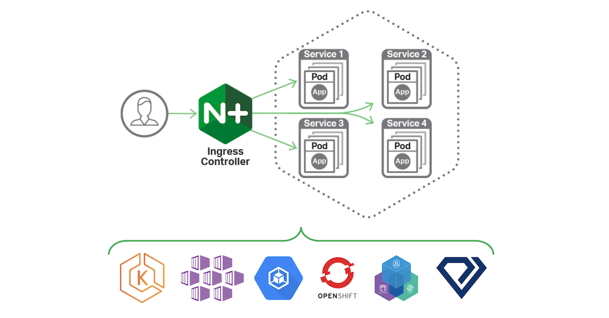

# 👨‍🎓 AWS 트러블 슈팅<br/><br/>

## Podman Issue<br/><br/>
- Docker 세팅 및 serverless Framework 사용 시 Podman Engine 이냐 Docker Engine 이냐에 따라 이슈 발생
- [Docker Podman Engine Issue](https://github.com/serverless/serverless/blob/main/lib/plugins/aws/provider.js#L2074)
- [Digest Result](https://stackoverflow.com/questions/28349392/how-to-push-a-docker-image-to-a-private-repository)
- [Podman Result](https://adamtheautomator.com/podman-for-windows/)
- [Redhat Install](https://docs.docker.com/engine/install/rhel/)
<br/><br/>
```bash
Q : docker engine 을 설치할 때, OS 가 centOS 인지 아니면 redhat 인지가 중요해 ?
A: ChatGPT
CentOS와 Red Hat Enterprise Linux (RHEL)은 기본적으로 매우 유사한 배포판으로, 많은 측면에서 호환됩니다. 따라서 Docker Engine을 설치할 때 OS가 CentOS인지 RHEL인지에 따라서 큰 차이는 없습니다.
Docker는 대부분의 경우 다양한 리눅스 배포판에서 작동합니다. 따라서 CentOS나 RHEL 둘 중 어느 것을 선택하더라도 Docker를 설치하고 실행하는 데 문제가 없을 것입니다. 다만, 배포판에 따라 패키지 관리자와 방법이 약간 다를 수 있습니다. CentOS의 경우 YUM을 사용하고, RHEL의 경우에는 RPM을 사용하는 경우가 일반적입니다.
따라서 CentOS 또는 RHEL 중에서 선택하는 경우에는 조직 또는 프로젝트의 정책, 지원 및 라이선스 모델 등을 고려해야 합니다. 일반적으로 CentOS는 무료이며 커뮤니티 지원을 받지만, RHEL은 상용 제품이므로 기업 환경에서는 추가적인 지원 및 보안 업데이트를 제공받을 수 있습니다.
```
<br/><br/>
# 👨‍🎓 AWS 컨테이너 람다 deploy 시 권한 에러<br/><br/>
- ECR 을 통해 컨테이너 람다를 배포하였으나, 일반: 권한이 거부됨 / 해당 파일을 로드할 수 없음 에러 발생
- 해당 이미지로 컨테이너를 실행시킨 후 bash 명령어를 통해 확인하였으나 [해당 디렉토리](https://peanut159357.tistory.com/106) 에 파일이 그대로 존재
- [AWS Docs 참조](https://docs.aws.amazon.com/ko_kr/lambda/latest/dg/troubleshooting-deployment.html#troubleshooting-deployment-denied)
- [리눅스 파일 권한](https://m31phy.tistory.com/256)
- [도커 이미지 유저 관리](https://effectivesquid.tistory.com/entry/Docker-Container%EB%A5%BC-root%EA%B0%80-%EC%95%84%EB%8B%8C-%EC%9D%BC%EB%B0%98-%EC%9C%A0%EC%A0%80%EB%A1%9C-%EC%8B%A4%ED%96%89%EC%8B%9C%ED%82%A4%EB%8A%94-%EB%B2%95)
- [멀티 스테이지 빌드](https://alexandre-vazquez.com/multi-stage-dockerfile/)
  <br/><br/>

# 👨‍🎓 AWS ECR Endpoint 세팅<br/><br/>
- [AWS Docs](https://docs.aws.amazon.com/ko_kr/AmazonECR/latest/userguide/vpc-endpoints.html)
- Windows 플랫폼 버전 1.0.0 이상을 사용하여 Fargate에서 호스팅되는 Amazon ECS 태스크를 수행하려는 경우, com.amazonaws.region.ecr.dkr 및 com.amazonaws.region.ecr.api Amazon ECR VPC 엔드포인트뿐만 아니라 Amazon S3 게이트웨이 엔드포인트까지 사용해야 이 기능을 활용할 수 있습니다.
- [AWS Prefix List](https://honglab.tistory.com/181)
  <br/><br/>
# 👨‍🎓 AWS ECS<br/><br/>
- [ECS 란](https://docs.aws.amazon.com/ko_kr/AmazonECS/latest/developerguide/Welcome.html)
- AWS Fargate는 애플리케이션을 모니터링하고 지표와 로그를 수집할 수 있는 AWS 서비스 및 서드 파티 도구와 기본적으로 통합됩니다. 또한 AWS Fargate를 사용하면 선불 비용 없이 사용한 컴퓨팅 리소스에 대해서만 비용을 지불하면 됩니다.
  <br/><br/>Image from aws<br/><br/>
- [ECS 최적화 AMI](https://docs.aws.amazon.com/ko_kr/AmazonECS/latest/developerguide/ecs-optimized_AMI.html)
- [ECS EC2](https://velog.io/@sawa1989/ECS-EC2%EC%82%AC%EC%9A%A9)
- [ASG ?](https://docs.aws.amazon.com/ko_kr/autoscaling/ec2/userguide/what-is-amazon-ec2-auto-scaling.html)
- 비용 ECS AMI 구독 시 r5.large 기준 연간 1,049 $, t2.small 기준 연간 559 $ 소요
- Launch Template 에서 User Data 부분에 ECS_CLUSER 관련 변수를 세팅해줘야 Cluster 와 통신 가능
- Task definition 에서 메모리 조정이 필요하며 잘못 설정할 경우 컨테이너 이미지 deploy 시 OOM 발생
- Fargate 의 경우 사용 시간에 따라 과금되며 Fargate SPOT 인스턴스를 활용할 경우 더 저렴하게 이용 가능
- [Fargate SPOT](https://aws.amazon.com/ko/blogs/korea/aws-fargate-spot-now-generally-available/)
- ALB 를 이용하여 ECS 인스턴스와 연결 가능하며, API GATEWAY 를 이용하고 싶을 경우 NLB 이용 및 VPC Link 로 연결 필요
- 장점
  - 보안 강화: VPC Link를 통해 API Gateway를 NLB와 연결하면 API 호출이 사설 네트워크를 통해 전송됩니다. 이는 외부 공격으로부터 API를 보호하는 데 도움이 될 수 있습니다.
  - 네트워크 지연 감소: API Gateway와 NLB가 동일한 VPC에 있을 때는 네트워크 지연이 더 낮을 수 있습니다. 이는 API 응답 시간을 줄여 성능을 향상시킬 수 있습니다.
  - 네트워크 관리: VPC Link를 사용하면 API Gateway와 NLB 간의 네트워크 구성을 더욱 세밀하게 제어할 수 있습니다. 예를 들어, 서브넷 및 보안 그룹 설정을 통해 네트워크 보안을 관리할 수 있습니다.
- 단점
  - 복잡성 증가: VPC Link를 설정하고 구성하는 것은 추가적인 관리 및 구성을 필요로 합니다. 이는 복잡성을 증가시킬 수 있으며 오류의 가능성을 높일 수 있습니다.
  - 비용: NLB 및 VPC Link를 사용하는 데 추가 비용이 발생할 수 있습니다. 특히, VPC Link가 사용되는 시간 및 전송된 데이터 양에 따라 비용이 발생할 수 있습니다.
  - Vendor Lock-in: API Gateway와 NLB 라는 특정 AWS 서비스에 종속되어 있기 때문에 다른 클라우드 공급자로의 이전이나 다중 클라우드 전략을 구현하기가 어려울 수 있습니다.
- [컨테이너 사이드카 패턴](https://m.blog.naver.com/ghdalswl77/222391621683)
- [Internal ALB 보안](https://towardsaws.com/ecs-service-communication-using-an-internal-load-balancer-919c7406389)
- [Building Modern Application with EKS](https://aws.amazon.com/ko/blogs/compute/building-modern-applications-with-amazon-eks-on-amazon-outposts/)
- [App mesh](https://aws.amazon.com/ko/app-mesh/)

# 👨‍🎓 AWS EKS<br/><br/>
- 쿠버네티스 인그레스 (Ingress) 란 일반적으로, 네트워크 트래픽은 Ingress와 egress (잘 사용하지는 않는 단어이긴 하지만) 으로 구분된다. Ingress는 외부로부터 서버 내부로 유입되는 네트워크 트래픽을, egress는 서버 내부에서 외부로 나가는 트래픽을 의미한다.
- 쿠버네티스의 Ingress는 Layer 7에서의 요청을 처리할 수 있다. 예컨대, 외부로부터 들어오는 요청에 대한 로드 밸런싱, TLS/SSL 인증서 처리, 특정 HTTP 경로의 라우팅 등을 Ingress를 통해 자세하게 정의할 수 있다. 물론, 이러한 기능들은 위에서 언급한 NodePort 등의 방법으로도 절대로 불가능한 것은 아니지만, 이러한 세부적인 로직을 모든 애플리케이션 개발 레벨에서 각각 구현하게 되면 서비스 운영 측면에서 추가적인 복잡성이 발생한다. 그 대신에, 외부 요청을 어떻게 처리할 것인지를 정의하는 집합인 Ingress를 정의한 뒤, 이를 Ingress Controller라고 부르는 특별한 웹 서버에 적용함으로써 추상화된 단계에서 서비스 처리 로직을 정의할 수 있다.
- ngress Controller 종류 및 사용 중인 클라우드 공급자에 따라 다양한 기능을 부가적으로 사용할 수도 있으니, 서비스를 외부로 노출시켜 제공해야 한다면 Ingress를 사용하는 것이 바람직하다. 뒤에서 다시 설명하겠지만, Ingress 요청을 처리하기 위한 Service는 일반적으로 클라우드 플랫폼에서 제공되는 Load Balancer 타입의 Service를 사용한다.
- 쿠버네티스에서 Ingress를 사용하기 위해서는 두 가지가 필요하다. 첫 번째는 YAML 파일에서 [kind: Ingress] 로 정의되는 Ingress 오브젝트이고, 두 번째는 Ingress 규칙이 적용될 Ingress Controller 이다. Ingress을 정의하는 YAML 파일은 아래와 같이 작성될 수 있다.
```yaml
apiVersion: extensions/v1beta1
kind: Ingress
metadata:
  name: nginx-ingress
  annotations:
    nginx.ingress.kubernetes.io/...
spec:
  rules:
    - host: black3279.github.io
      http:
        paths:
          - path: /api/hostname-service
            backend:
              serviceName: hostname-service
              servicePort: 80
```
- Ingress를 정의하는 위 YAML 파일은 매우 간단하다. [1] black3279.github.io 이라는 호스트 명으로 접근하는 네트워크 요청에 대해서 Ingress 규칙을 적용하되, [2] http 프로토콜을 통해 [3] /api/hostname-service 라는 경로로 접근하는 요청을 [4] hostname-service 라는 이름의 Service의 80 포트로 전달하라는 뜻이다. (hostname-service와 hostname-deplyment는 미리 생성되어 있다고 가정한다. 컨테이너의 호스트 이름을 확인하는 매우 간단한 예제이다)
- 그러나 위 YAML 파일로부터 Ingress를 생성해도 아무 일도 일어나지 않는다. Ingress는 단지 Ingress 규칙을 정의하는 선언적인 오브젝트일 뿐, 외부 요청을 받아들이는 실제 서버가 아니기 때문이다. Ingress는 Ingress Controller라고 하는 특수한 서버 컨테이너에 적용되어야만 Ingress에 적용된 규칙이 활성화된다. 즉, Ingress Controller가 외부로부터 네트워크 요청을 수신했을 때, Ingress 규칙에 기반해 이 요청을 어떻게 처리할지를 결정한다.
  <br/><br/>Image from nginx<br/><br/>
- Ingress Controller를 어떻게 설치해 실행할 수 있을까? 이 경우는 Ingress Controller를 직접 운영할지, 클라우드 플랫폼에 위임할지에 따라서 조금 고민해 볼 필요가 있다. 직접 Ingress Controller를 구동하려면 Nginx 웹 서버 기반의 Nginx Ingress Controller를 사용할 수 있겠고, 클라우드 플랫폼에 위임하려면 GKE (Google Kubernetes Engine) 의 기능을 사용할 수도 있다. 
- 만약 AWS에서 EKS 또는 EC2 기반의 Kubespray를 사용하고 있다면, Nginx Ingress Controller를 직접 생성해 사용하되, 외부에서 Nginx에 접근하기 위한 쿠버네티스 Service를 Load Balancer 타입으로 설정해 로드 밸런서를 생성하는 방법을 생각해 볼 수 있다. 이 때, ELB / NLB / ALB 중 어느 로드 밸런서를 선택해야 하는지는 쿠버네티스 애플리케이션의 특성을 고려해 결정해야 한다. (ex. gRPC 지원 여부, 대규모 트래픽 필요 여부 등)
  <br/><br/>
- [Ingress 설명](https://lordofkangs.tistory.com/566)
- [Service Mesh](https://medium.com/dtevangelist/service-mesh-%EB%9E%80-8dfafb56fc07)
- [Service Mesh with Istio](https://velog.io/@shinjw4675/Kubernetes-Istio%EB%9E%80)
- [Istio](https://kr.linkedin.com/pulse/istio%EB%8A%94-%EB%AC%B4%EC%97%87%EC%9D%B4%EA%B3%A0-%EC%99%9C-%EC%A4%91%EC%9A%94%ED%95%A0%EA%B9%8C-sean-lee)
- [쿠버네티스 네트워크1](https://velog.io/@seunghyeon/%EC%BF%A0%EB%B2%84%EB%84%A4%ED%8B%B0%EC%8A%A4-%EB%84%A4%ED%8A%B8%EC%9B%8C%ED%81%AC-%EA%B5%AC%EC%84%B1%EB%8F%84)
- [쿠버네티스 네트워크2](https://medium.com/finda-tech/kubernetes-%EB%84%A4%ED%8A%B8%EC%9B%8C%ED%81%AC-%EC%A0%95%EB%A6%AC-fccd4fd0ae6)
- [AWS EKS](https://docs.aws.amazon.com/ko_kr/eks/latest/userguide/what-is-eks.html)