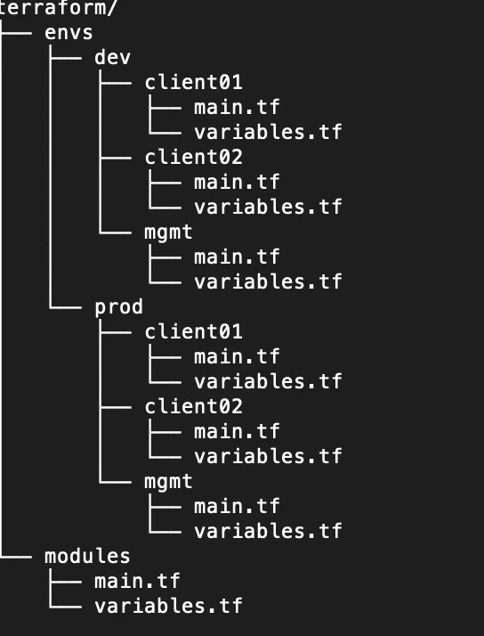

# 👨‍🎓 Terraform<br/><br/>

## IaC (Infrastructure as Code)
- VM ware, Hyper-v와 같은 기술을 통해서 여러대의 서버를 더 많이 쉽게 만들 수 있게 되었다.
- 하지만 늘어나는 서버에 대한 프로비저닝과 운영에 대한 병목이 발생.
- 인력을 계속해서 증원할 수 없었기 때문에 서버 구축과 운영 자동화가 필요해짐.
- 이러한 배경에서 프로그래밍 코드로 인프라를 구축/운영할 수 있는  IaC 가 탄생.

## IaC 종류
- IaC 에는 Provisioning 도구와 SCM 구성 관리 도구가 있다.
- Provisioning Tool
  - 일반적으로 운영팀의 담당자가 컴퓨터나 가상 호스트를 사용해 개발팀에서 필요한  라이브러리나 서비스를 설치  하는 것을 의미한다. 프로비저닝 영역에서는 개발팀이 사용한 코드 버전과 동일한 버전을 사용해  네트워크, VM, DB 등을 구성한다.
- SCM Tool
  - 구성관리는 성능부터 H/W 속성과 라이프사이클 전반에 걸친 요구사항, 설계 및 운영 정보 의 일관성 등을 설정하고 유지하기 위한 시스템 프로세스이다. 프로비저닝이 인프라에 대한 배포 위주에 진행된다면, 구성관리는 애플리케이션의 구성 설정을 관리 하는 영역이다.


## Terraform 이란<br/><br/>
- [테라폼 소개](https://www.youtube.com/watch?v=SGH0uDni-WY&t=2s)
- Hashicorp 에서 Go 언어로 개발한 오픈소스 IaC(Infrastructure as Code) 도구
- IaC는 '인프라를 코드로 관리한다' 는 개념으로 테라폼에서는 HCL(Hashicorp Configuration Language)를 이용해 클라우드 자원을 관리한다.
- AWS CloudFormation 의 경우 AWS 만 지원하지만 테라폼은 AWS, GCP(구글), Azure(MS), Naver Cloud 등 같은 주요 클라우드 서비스들을 프로바이더로 제공한다.
- 테라폼만으로 멀티 클라우드 리소스들을 선언하고 일괄적으로 관리하는 것이 가능하다.
- 프로비저닝 순서
  - 1단계 : 프로바이더 계정, 키 설정
  - 2단계 : 필요한 리소스 선언 및 tf 파일 생성
  - 3단계 : 리소스들의 생성/변경/삭제 계획 확인(terraform plan)
  - 4단계 : 리소스들을 클라우드에 적용(terraform apply)
- [테라폼 사용기](https://www.youtube.com/watch?v=VgN8gL8r7so)
<br/><br/>Image from hashicorp<br/><br/>

## 테라폼 Variable 타입
- String
- Number
- Bool
- List(type)
- Set(type)
- Map(type)
- Tuple

## [example](https://registry.terraform.io/providers/hashicorp/aws/latest/docs)
```bash
terraform {
  required_providers {
    aws = {
      source  = "hashicorp/aws"
      version = "~> 4.8.0"
    }
  }
  required_version = ">= 1.1.6"
}

provider "aws" {
  profile = "tfadmin_hrlab"
  region  = "us-east-1"
}

provider "aws" {
  profile = "tfadmin_hrlab"
  region  = "ap-northeast-2"
  alias   = "kr"
}

provider "aws" {
profile = "tfadmin_hrlab"
region  = "us-east-1"
alias   = "us"
}
```

<br/><br/>
Image from reddit

<br/><br/>

## [Terraform AWS Module](https://registry.terraform.io/namespaces/terraform-aws-modules)

- 모듈을 통해 소스 참조 가능,모듈 다운로드 및 모듈 사용 가능
- terraform init 커맨드 시에 로컬에 자동으로 모듈 소스가 다운로드 됨

<br/><br/>
# 👨‍🎓 사용 후기 <br/><br/>
> 기존 AWS Cloudformation 과 같은 경우, 리소스 배포를 위한 스택을 생성하다가 중복 리소스가 발생하거나, 
> 스택을 삭제하려는데 에러가 발생 한 경우, 롤백을 위해 연결된 자원을 파악하는 과정에서 너무 많은 시간이 소요되어
> 오래 걸리는 경우 최대 45분 까지 기다려야 하는 경우가 생기는데, 이러한 점이 배포의 관점에서는 치명적이었다.
> 반면에 테라폼은 프로바이더가 제공하는 API 를 직접 호출하므로 소요되는 시간이 많지 않고 프로바이더에서 공식적으로
> 제공하는 리소스 모듈들도 있어서 학습 비용이 크지 않았다.
> 또한 VPC 를 이전한다던지, 횡전개하는 과정에서 소스를 복사하거나 모듈만 가져오면 되는 편리함이 있었다.
> 그리고 tf 파일을 수정하는 기능도 제공하기 때문에 레거시 관리나 커밋 이력을 통한 히스토리 관리에도 유용했다.
  <br/><br/>

```bash
# provider.tf

provider "aws"{
    region = "ap-northeast-2"
}


# vpc.tf
resource "aws_vpc" "main" {
    cidr_block = "10.0.0.0/16"

    tags = {
        Name = "terraform-vpc"
    }
}

resource "aws_route_table" "private_route" {
  vpc_id = aws_vpc.main.id
}

resource "aws_route" "private_nat" {

    route_table_id = aws_route_table.private_route.id
    destination_cidr_block = "0.0.0.0/0"
}
```
- 위와 같은 코드가 있는 경우, 테라폼은 리소스간 연결된 참조 관계, aws_vpc - aws_route_table - aws_route 를 파악하여 각 리소스 생성 전 선행 생성이 필요한 순서대로 리소스를 생성해준다.
- 또한 이러한 소스 파악을 통해 전체 인프라 구조가 어떻게 구성되었는지 파악이 가능하며, 전체 태그 적용을 통해 리소스 현황을 태그를 통해 가져와서 취합할 수 있다.