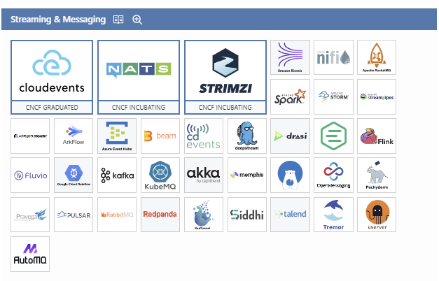
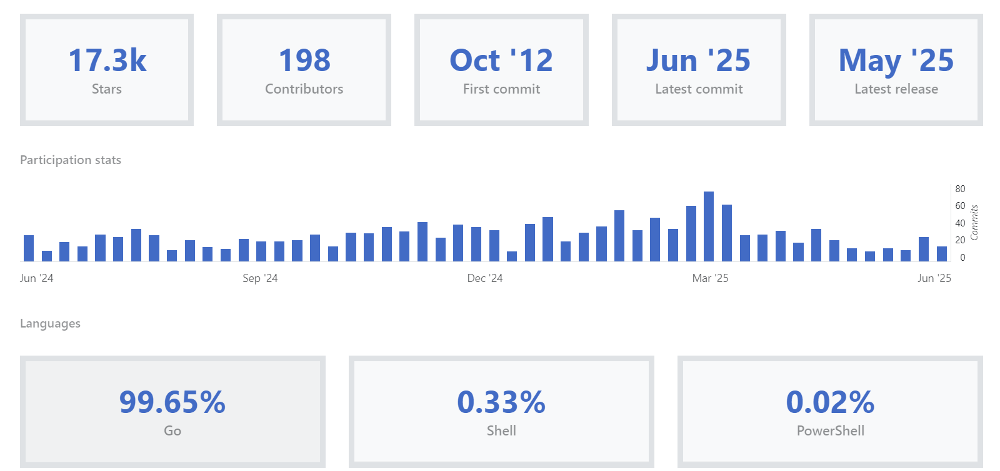
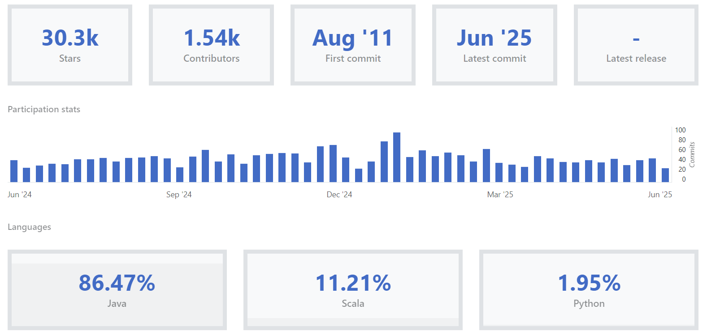
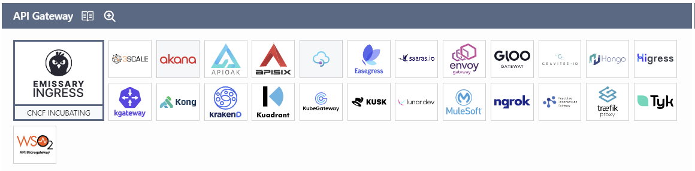
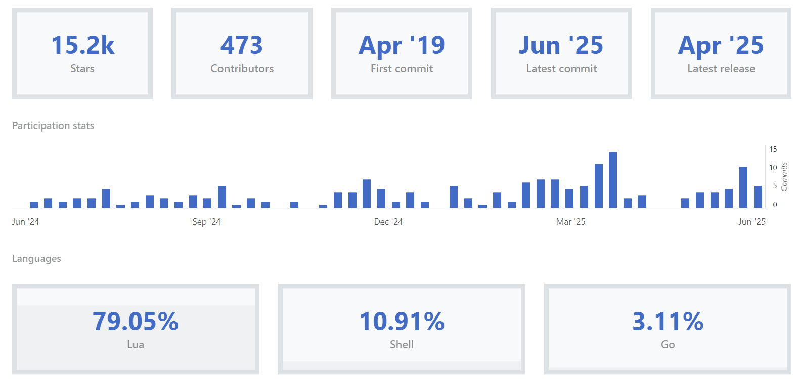
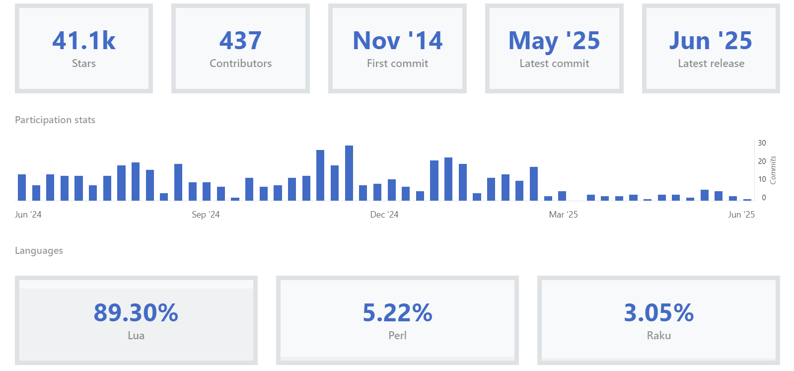
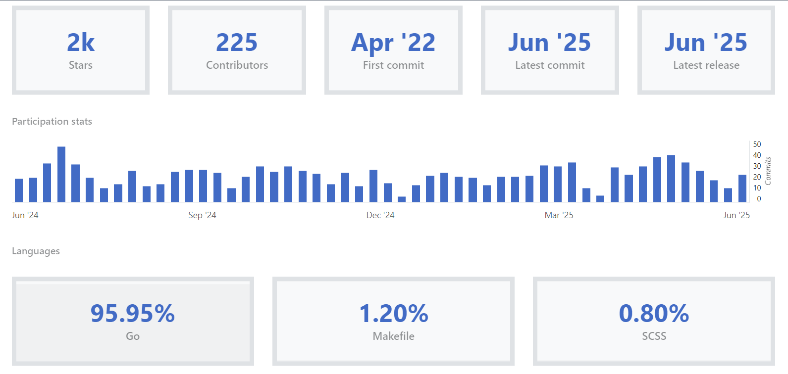

# 👨‍🎓 Messaging Queue 와 API Gateway 오픈 소스 분석<br/><br/>

## Messaging Queue
- [Cloud Landscape](http://landscape.cncf.io/)
<br/><br/>Image from CNCF<br/><br/>

✅ NATS <br/>

📌 서비스 목적 <br/>

경량화된 메시징 시스템으로, 마이크로서비스 간 고속 통신, IoT, 이벤트 기반 아키텍처를 위한 pub/sub, request/reply, queue 모델을 지원합니다.

⚙️ 동작 원리 <br/>

Core NATS는 at-most-once 전송을 기본으로 하는 pub/sub 모델. <br/>
JetStream이라는 확장 기능을 통해 영속성 있는 메시징, 재전송, streaming, durable consumer 등을 지원. <br/>
메시지를 브로커(중앙 서버)에 발행하면, 해당 주제를 구독하고 있는 subscriber들이 메시지를 수신합니다. <br/>

💻 주 사용 언어 <br/>

자체 구현: Go <br/>
클라이언트 라이브러리: Go, Python, Java, C, JavaScript, Rust, Ruby 등 <br/>

🚀 성능 및 확장성 <br/>

극도로 경량화되어 있어 수십만 RPS 처리 가능. <br/>
Latency < 1ms 수준, 단일 바이너리로 실행, 수십 MB 메모리로도 충분. <br/>
JetStream 도입 후에는 분산 메시지 저장 및 확장성 확보 가능. <br/>

<br/><br/>Image from CNCF<br/><br/>


#### Core NATS
- **정의**: NATS의 기본 메시징 시스템. 단순한 pub/sub, request/reply, 큐잉 모델 제공
- **QoS (Quality of Service)**: 기본적으로 *at-most-once* 메시지 전달 (최대 1회 전달, 메시지 손실 가능성 존재)
- **메시지 저장**: 인메모리 처리, 서버 재시작 시 메시지 소실
- **클러스터링**: 풀 메시 클러스터링(full mesh clustering) 지원으로 고가용성 제공
- **특징**:
  - 극도로 경량화되어 초저지연(<1ms) 메시징 지원
  - 수십만 RPS 처리 가능
  - 단순한 운영과 빠른 성능에 초점

#### JetStream
- **정의**: Core NATS 위에 내장된 분산 메시지 스트리밍 및 영속성 저장 기능
- **QoS**: *at-least-once* 전달 보장 및 재전송, 스트림 기반 메시지 처리
- **메시지 저장**: 디스크 기반 영속 저장, 복제(Replicas) 가능
- **특징**:
  - 메시지 재전송, 내구성, 정확히 한 번 전달(exactly-once) 지원 가능 (클라이언트 ID 활용)
  - 스트림에 메시지 저장 및 관리
  - 복수 서버에 걸친 고가용성 및 확장성 지원
  - Core NATS와의 상호운용 가능

---

#### Subject
- 메시지를 발행(publish)하고 구독(subscribe)하기 위해 사용되는 식별자(토픽과 유사)
- 계층적 네임스페이스와 와일드카드를 사용 가능 → 유연한 구독과 라우팅 지원
- 예: `orders.new`, `users.*`

#### Stream (JetStream)
- 메시지를 저장 및 관리하는 논리적 단위
- 하나 이상의 **subject**를 포함하여 정의됨 (예: `orders.*` subject를 포함하는 Stream 생성)
- 메시지 저장 정책 지정 가능 (메모리/파일 스토리지, 최대 크기, 보존 기간 등)
- JetStream 내에서 메시지는 스트림에 저장되고, 구독자는 이 스트림에서 메시지를 읽음
- 스트림은 Kafka 토픽과 유사하지만, 더 경량이며 유연한 설정 가능

#### Partitioning
- Core NATS 자체는 **파티셔닝 기능이 없음**
- JetStream에서는 스트림 복제(Replication)와 분산 클러스터링을 통해 내구성과 확장성을 보장
- 여러 서버에 스트림을 복제하여 장애 허용성 제공
- 논리적 파티셔닝 대신, subject 네임스페이스와 스트림 분할로 메시지 분산 처리 가능
- 클라이언트 측에서 subject 설계와 스트림 구성으로 트래픽 분산 및 파티셔닝 효과 구현

---

#### Core NATS Architecture
- **서버**: `nats-server` 실행, 클러스터로 여러 서버 구성 가능(풀 메시 네트워크)
- **클라이언트**: 다양한 프로그래밍 언어용 클라이언트 라이브러리 제공(Go, Java, Python 등)
- **메시지 라우팅**: 서버 간 메시지 라우팅과 클러스터링으로 고가용성 확보
- **운영 편의성**: 단일 바이너리, 경량 설치 및 빠른 시작

#### JetStream Architecture
- JetStream은 nats-server에 내장된 모듈로 활성화 옵션(`-js`) 필요
- 서로 다른 서버들 간 스트림 리플리케이션 구성 가능 (복제본 3개 이상 권장)
- 영속성 저장소: 파일 기반 저장 및 메모리 저장 선택 가능
- 메시지 인덱싱, 소비자 관리, 메시지 필터링 등 관리 기능 내장
- 모니터링 API와 메트릭스 제공 (Prometheus, Grafana 연동 가능)

---

#### 인증 및 권한 부여
- NATS는 기본적으로 토큰 기반 인증 또는 TLS 클라이언트 인증 지원
- 사용자 계정, 권한 정책(ACL)을 통해 메시지 발행·구독 권한 상세 제어 가능 (subject 단위 가능)
- OAuth, JWT Token 등 외부 인증 연동도 가능

#### TLS 암호화
- 서버와 클라이언트 간 통신 TLS 지원으로 전송 중 데이터 암호화 가능
- 클러스터 간 라우팅도 TLS로 보호 가능

#### 메시지 무결성 및 안정성 (JetStream)
- 영속 저장, 복제, 메시지 확인 응답(Ack) 기능으로 데이터 유실 최소화
- Producer와 Consumer 간 Flow control과 Ack 메커니즘으로 메시지 중복·손실 방지
- 메시지 헤더에 고유 ID 삽입해 동일 메시지 중복 처리 방지(Exactly-once 가능)


---

#### 요약 및 참고

| 구분               | Core NATS                          | JetStream                             |
|--------------------|----------------------------------|-------------------------------------|
| QoS                | 최대 1회(delivery at-most-once)  | 최소 1회(delivery at-least-once), Exactly-once 지원 가능 |
| 메시지 저장         | 인메모리, 비영속                  | 디스크 영속, 복제 가능               |
| 메시징 패턴         | pub/sub, request/reply, 큐잉       | 스트림 기반 메시징                   |
| 확장성              | 풀 메시 클러스터링 지원           | 스트림 복제 및 분산 저장             |
| 사용 예             | 경량 실시간 메시징, IoT, 이벤트  | 내구성 필요한 스트림 처리, 대용량 이벤트 저장 |
| 보안 기능           | 인증, 권한, TLS 지원               | 인증, 권한, TLS + 메시지 Ack 및 재전송 지원 |

---

#### 예제: JetStream 스트림 생성 및 메시지 퍼블리시 (Go)
```
nc, _ := nats.Connect("nats://localhost:4222")
defer nc.Close()

js, _ := nc.JetStream()

// 스트림 생성
streamConfig := &nats.StreamConfig{
Name: "ORDERS",
Subjects: []string{"orders.*"},
Storage: nats.FileStorage,
Replicas: 3,
}
js.AddStream(streamConfig)

// 메시지 발행 (JetStream 방식)
js.Publish("orders.new", []byte("New order data"))
```

### SPARK
✅ Apache Spark
📌 서비스 목적
대규모 데이터 처리 및 분석을 위한 분산 컴퓨팅 플랫폼.

배치 처리뿐 아니라 스트리밍, 머신러닝, 그래프 처리 등도 지원.

⚙️ 동작 원리
Driver 프로그램이 job을 제출 → Cluster Manager가 리소스를 관리 → Executor들이 작업 처리.

데이터는 RDD (Resilient Distributed Dataset) 혹은 DataFrame/Dataset 형태로 처리.

메모리 기반 연산으로 MapReduce보다 빠름.

💻 주 사용 언어
자체 구현: Scala

공식 API 지원: Scala, Java, Python (PySpark), R

🚀 성능 및 확장성
메모리 기반 처리로 매우 빠름 (최대 100x 빠른 배치 성능).

수천 노드 규모까지 수평 확장 가능.

Spark Streaming이나 Structured Streaming으로 실시간 처리 지원.
<br/><br/>Image from CNCF<br/><br/>

### KAFKA
✅ Apache Kafka
📌 서비스 목적
대용량 데이터 스트리밍을 위한 분산 메시지 큐 시스템.

데이터 수집, 처리, 저장, 분석을 위한 신뢰성 높은 로그 기반 메시지 브로커 역할.

⚙️ 동작 원리
Producer가 Topic으로 메시지를 전송 → Broker가 메시지를 분산 저장 → Consumer가 메시지를 Pull 방식으로 가져감.

메시지는 디스크에 저장되며, 파티션 단위로 분산되어 처리됨.

Zookeeper 혹은 KRaft 기반 클러스터 관리.

💻 주 사용 언어
자체 구현: Java + Scala

클라이언트 라이브러리: Java, Python, Go, .NET, Node.js 등

🚀 성능 및 확장성
수백 MB/s 이상의 처리량, 수천 개의 파티션까지 확장 가능.

디스크 기반 저장으로 내구성 및 재처리 지원.

브로커 수 및 파티션 수로 수평 확장 가능하지만, 운영 복잡도 높음.
<br/><br/>Image from CNCF<br/><br/>

✅ 비교 표


| 항목           | NATS                          | Apache Kafka                                 | Apache Spark                                 |
|----------------|-------------------------------|-----------------------------------------------|-----------------------------------------------|
| **서비스 목적** | 경량 메시징, 마이크로서비스 통신  | 대용량 데이터 스트리밍, 이벤트 로그 저장        | 대규모 데이터 분석, 배치 및 실시간 처리         |
| **동작 원리**   | Pub/Sub, JetStream 기반 메시지 큐 | 분산 로그 기반 메시지 브로커                    | DAG 기반 분산 연산, 메모리 기반 데이터 처리     |
| **주 사용 언어**| Go                             | Java + Scala                                  | Scala (Python, Java, R API 지원)              |
| **확장성**     | 경량/고속, JetStream 확장 지원     | 수천 개 파티션까지 수평 확장 가능               | 수천 노드까지 확장 가능                        |
| **성능**       | < 1ms latency, 초당 수십만 건 처리 | 고속 처리 (MB/s~GB/s), 디스크 기반 저장         | 인메모리 처리로 고성능 (최대 100x 빠름)         |
| **장점**       | 초경량, 빠름, 단순한 구조          | 높은 내구성, 재처리 가능, 생태계 풍부           | 다양한 처리 유형 지원, 확장성 및 유연성 뛰어남   |
| **단점**       | 메시지 영속성 및 관리 기능은 제한적 | 운영 복잡도 높음, Zookeeper 등 구성 필요        | 메모리 사용량 높고 복잡도 높음                 |
| **사용 목적**  | 실시간 메시징, IoT, 경량 이벤트 처리| 대용량 이벤트 스트리밍, 로그 처리, ETL          | 빅데이터 처리, 머신러닝 파이프라인, 배치 분석    |


## API Gateway
- [Cloud Landscape](http://landscape.cncf.io/)
  <br/><br/>Image from CNCF<br/><br/>


✅ APISIX
  <br/><br/>Image from CNCF<br/><br/>

목적: 고성능 API 게이트웨이 (클라우드 네이티브)

동작: etcd 기반 설정 + Lua 플러그인 아키텍처

언어: Lua + NGINX (OpenResty)

성능: <1ms 레이턴시, 10만 RPS 이상

특징: 실시간 동적 구성, 경량성 탁월

👉 Rate Limiting (APISIX)

Local Limit: limit-count, limit-conn, limit-req 플러그인 등이 NGINX 내에서 토큰 버킷 방식으로 처리하며, 메모리 기반으로 실행

Global Limit: limit-count 플러그인과 Redis 연동 시, 다수 인스턴스 간 공유 Rate Limit 적용 가능 (전역 상태 유지)

<br/>

✅ Kong
  <br/><br/>Image from CNCF<br/><br/>

목적: API 게이트웨이 + 서비스 메시 프록시

동작: NGINX 기반, PostgreSQL/Cassandra 구성 저장

언어: Lua + 일부 Go

성능: 고성능, 다양한 플러그인 내장

특징: 커뮤니티 활성화, 다양한 배포 옵션

👉 Rate Limiting (Kong)

Local Limit: 기본적으로는 노드별 로컬 제한 (memory, cluster-wide X)

Global Limit: Redis backend 설정 시, 전역 제한(Global Rate Limit) 적용 가능 (클러스터 전체에서 공유)

기술 방식: 토큰 버킷 알고리즘 기반의 rate-limiting 플러그인이 메모리 or Redis backend 중 선택 가능

🔍 토큰 버킷 알고리즘(Token Bucket Algorithm) 개요

요청이 발생할 때마다 "토큰"이 필요하며, 일정한 속도로 토큰이 추가됨

버킷이 비어 있으면 요청이 차단되거나 지연됨 (Rate Limit 적용)

제한된 범위 내의 burst 트래픽을 허용함으로써 유연한 제어 가능

대부분의 API Gateway에서 로컬 또는 글로벌 Rate Limit 구현 시 활용됨

                           [토큰 생성기]
                                │
                (일정 시간마다 버킷에 토큰 추가)
                                ▼
                        ┌─────────────┐
                        │   버킷         ← 최대 용량 N
                        │  ◯ ◯ ◯ ◯    (여유 공간이 있을 때만 추가)
                        └─────┬───────┘
                              │
              (요청이 오면 토큰이 있나? 확인)
                 ┌───────┴─────────┐
                 ▼                 ▼
            [토큰 있음]         [토큰 없음]
              │                    │
              ▼                    ▼
          [요청 큐에 진입]      [요청 거절]
            │
            ▼
        [토큰 차감 → 요청 처리]
          │
          ▼
    [응답 반환]


✅ Istio 개요

Istio는 서비스 메시로서, 마이크로서비스 간 통신, 보안, 트래픽 제어, 정책 적용, 관측 등을 중앙에서 관리하는 솔루션입니다.

Envoy Proxy를 사이드카로 사용하며, 데이터 평면과 제어 평면 분리 구조를 따릅니다.

✅ Envoy Gateway

목적: Kubernetes 중심의 클라우드 네이티브 API Gateway

동작: Envoy Proxy 기반, Gateway API(K8s CRD) 사용

언어: C++ (Envoy), Go (Control Plane)

성능: 높은 확장성, 보안 및 성능 우수

특징: K8s에 최적화된 아키텍처, CRD 기반 구성

✅ EnvoyFilter의 역할

Envoy의 동작을 세부적으로 제어하기 위한 미세 설정 도구

주로 다음 용도로 사용됨:

Rate limiting (로컬/글로벌)

인증, 인가 필터 삽입

커스텀 로깅 및 헤더 조작

OpenTelemetry 기반 tracing 삽입

✅ HTTP Filter Chain 구조

HTTP 요청이 Envoy로 들어오면, 여러 개의 HTTP 필터를 순차적으로 통과합니다

필터는 순서대로 실행되며, 라우팅 전/후 동작을 삽입 가능

envoy.filters.http.router는 반드시 가장 마지막 필터로 위치

필터 체인 내 필터는 INSERT_BEFORE, INSERT_AFTER, REPLACE 등의 방식으로 삽입 가능


                      [클라이언트 요청]
                          │
                          ▼
                      ┌──────────────────┐
                      │  Listener (접점) │
                      └──────────────────┘
                          │
                          ▼
                      ┌───────────────────────────────┐
                      │      HTTP Filter Chain        │
                      │ ┌────────────┐                │
                      │ │ Filter A   │  ──▶ (전/후 처리) 
                      │ └────────────┘                │
                      │ ┌────────────┐                │
                      │ │ Filter B   │  ──▶ (전/후 처리) 
                      │ └────────────┘                │
                      │ ┌────────────┐                │
                      │ │ Filter C   │  ──▶ (전/후 처리) 
                      │ └────────────┘                │
                      └───────────────────────────────┘
                          │
                          ▼
                      ┌─────────────────┐
                      │  라우터 필터(Router Filter) │  ← 필터 체인 마지막
                      └─────────────────┘
                          │
                          ▼
                      [최종 목적지 (백엔드 서비스, API 등)]


✅ EnvoyFilter 평가 및 적용 프로세스

적합성 평가:

EnvoyFilter가 많아질수록 요청당 필터 평가 비용 증가

필터 매칭은 context, listener, filterChain, headers, routes 등 복합 조건을 기반으로 동작

HTTP 요청 헤더 또는 경로(path)에 따라 적용 가능한 필터를 빠르게 선별하는 로직 필요

라우팅 전 사전 필터링을 통한 최적화가 중요 (불필요 필터 제거)

다수의 Rate Limit 필터가 동일 Route에 설정되었을 경우, 가장 일치하는 필터만 평가되도록 구성 필요

  <br/><br/>Image from CNCF<br/><br/>


✅ 비교 표

| 항목           | APISIX                             | Kong                                  | Envoy Gateway                               |
|----------------|-------------------------------------|----------------------------------------|---------------------------------------------|
| **서비스 목적** | 고성능 API 게이트웨이 및 라우터       | API 게이트웨이 및 서비스 프록시         | Envoy 기반의 클라우드 네이티브 API Gateway |
| **동작 원리**   | etcd + NGINX + Lua 플러그인         | NGINX 기반, DB 설정 (PostgreSQL 등)    | Envoy Proxy 위에 K8s Gateway API 기반 작동  |
| **주 사용 언어**| Lua + NGINX (OpenResty)             | Lua + NGINX (일부 Go)                  | C++ (Envoy) + Go (Gateway Control Plane)    |
| **확장성**     | etcd 클러스터 기반 확장, 매우 경량    | 엔터프라이즈 및 인그레스 지원, 다양한 배포| Kubernetes 네이티브, 대규모 확장 지원       |
| **성능**       | <1ms 레이턴시, 초당 10만 RPS 이상    | 높은 성능 + 다양한 내장 플러그인        | Envoy 성능 그대로 사용 (높은 처리량/확장성) |
| **장점**       | 동적 구성, 경량, 빠름, 플러그인 다양  | 커뮤니티 크고, 기능 다양, 플러그인 확장 가능| Envoy의 보안성과 성능 계승, K8s 통합 우수   |
| **단점**       | Lua 기반 환경, 초기 러닝 커브         | 일부 기능은 Enterprise 전용             | Envoy에 대한 학습 필요, 복잡한 구성 가능성  |
| **사용 목적**  | 마이크로서비스 게이트웨이, 클라우드 API 관리| API 인증, 라우팅, 모니터링, 서비스 연결 | Kubernetes 네이티브 API 게이트웨이 솔루션  |


## 결론 및 선택 가이드

Messaging Queue 선택 기준

실시간 경량 통신: NATS

대용량 스트리밍 및 로그: Kafka

빅데이터 분석 및 ML 처리: Spark

API Gateway 선택 기준

빠르고 동적인 구성: APISIX

커뮤니티/기능/운영 안정성: Kong

K8s 기반 네이티브 통합: Envoy Gateway

Istio와 Envoy 기반 Rate Limit이 필요한 경우: Envoy Gateway + Istio 조합

## 참고 링크

- CNCF Landscape: http://landscape.cncf.io/
- APISIX: https://apisix.apache.org/
- Kong: https://konghq.com/
- Envoy Gateway: https://gateway.envoyproxy.io/
- Istio Rate Limiting: https://istio.io/latest/docs/tasks/policy-enforcement/rate-limit/
- Envoy HTTP Filter 문서:<br/>
https://www.envoyproxy.io/docs/envoy/latest/intro/arch_overview/http/http_filters <br/>
https://www.envoyproxy.io/docs/envoy/latest/api-v3/config/route/v3/route_components.proto <br/>

- NATS: https://nats.io/
- Apache Kafka: https://kafka.apache.org/
- Apache Spark: https://spark.apache.org/