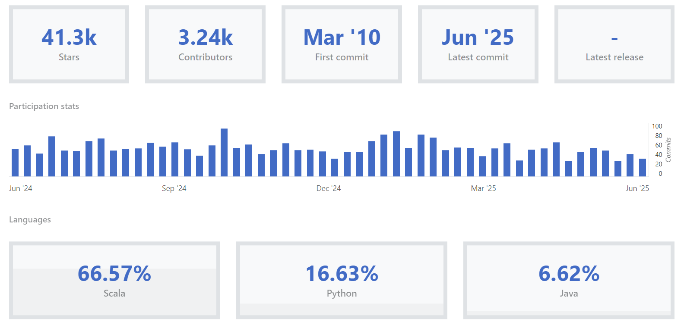

# 👨‍🎓 Messaging Queue 와 API Gateway 오픈 소스 분석  

## Messaging Queue
- [Cloud Landscape](http://landscape.cncf.io/)
  Image from CNCF  

✅ NATS
📌 서비스 목적
경량화된 메시징 시스템으로, 마이크로서비스 간 고속 통신, IoT, 이벤트 기반 아키텍처를 위한 pub/sub, request/reply, queue 모델을 지원합니다.

⚙️ 동작 원리
Core NATS는 at-most-once 전송을 기본으로 하는 pub/sub 모델.

JetStream이라는 확장 기능을 통해 영속성 있는 메시징, 재전송, streaming, durable consumer 등을 지원.

메시지를 브로커(중앙 서버)에 발행하면, 해당 주제를 구독하고 있는 subscriber들이 메시지를 수신합니다.

💻 주 사용 언어
자체 구현: Go

클라이언트 라이브러리: Go, Python, Java, C, JavaScript, Rust, Ruby 등

🚀 성능 및 확장성
극도로 경량화되어 있어 수십만 RPS 처리 가능.

Latency < 1ms 수준, 단일 바이너리로 실행, 수십 MB 메모리로도 충분.

JetStream 도입 후에는 분산 메시지 저장 및 확장성 확보 가능.
  Image from CNCF  

### SPARK
✅ Apache Spark
📌 서비스 목적
대규모 데이터 처리 및 분석을 위한 분산 컴퓨팅 플랫폼.

배치 처리뿐 아니라 스트리밍, 머신러닝, 그래프 처리 등도 지원.

⚙️ 동작 원리
Driver 프로그램이 job을 제출 → Cluster Manager가 리소스를 관리 → Executor들이 작업 처리.

데이터는 RDD (Resilient Distributed Dataset) 혹은 DataFrame/Dataset 형태로 처리.

메모리 기반 연산으로 MapReduce보다 빠름.

💻 주 사용 언어
자체 구현: Scala

공식 API 지원: Scala, Java, Python (PySpark), R

🚀 성능 및 확장성
메모리 기반 처리로 매우 빠름 (최대 100x 빠른 배치 성능).

수천 노드 규모까지 수평 확장 가능.

Spark Streaming이나 Structured Streaming으로 실시간 처리 지원.
  Image from CNCF  

### KAFKA
✅ Apache Kafka
📌 서비스 목적
대용량 데이터 스트리밍을 위한 분산 메시지 큐 시스템.

데이터 수집, 처리, 저장, 분석을 위한 신뢰성 높은 로그 기반 메시지 브로커 역할.

⚙️ 동작 원리
Producer가 Topic으로 메시지를 전송 → Broker가 메시지를 분산 저장 → Consumer가 메시지를 Pull 방식으로 가져감.

메시지는 디스크에 저장되며, 파티션 단위로 분산되어 처리됨.

Zookeeper 혹은 KRaft 기반 클러스터 관리.

💻 주 사용 언어
자체 구현: Java + Scala

클라이언트 라이브러리: Java, Python, Go, .NET, Node.js 등

🚀 성능 및 확장성
수백 MB/s 이상의 처리량, 수천 개의 파티션까지 확장 가능.

디스크 기반 저장으로 내구성 및 재처리 지원.

브로커 수 및 파티션 수로 수평 확장 가능하지만, 운영 복잡도 높음.
  Image from CNCF  

✅ 비교 표

| 항목           | NATS                          | Apache Kafka                                 | Apache Spark                                 |
|----------------|-------------------------------|-----------------------------------------------|-----------------------------------------------|
| **서비스 목적** | 경량 메시징, 마이크로서비스 통신  | 대용량 데이터 스트리밍, 이벤트 로그 저장        | 대규모 데이터 분석, 배치 및 실시간 처리         |
| **동작 원리**   | Pub/Sub, JetStream 기반 메시지 큐 | 분산 로그 기반 메시지 브로커                    | DAG 기반 분산 연산, 메모리 기반 데이터 처리     |
| **주 사용 언어**| Go                             | Java + Scala                                  | Scala (Python, Java, R API 지원)              |
| **확장성**     | 경량/고속, JetStream 확장 지원     | 수천 개 파티션까지 수평 확장 가능               | 수천 노드까지 확장 가능                        |
| **성능**       | < 1ms latency, 초당 수십만 건 처리 | 고속 처리 (MB/s~GB/s), 디스크 기반 저장         | 인메모리 처리로 고성능 (최대 100x 빠름)         |
| **장점**       | 초경량, 빠름, 단순한 구조          | 높은 내구성, 재처리 가능, 생태계 풍부           | 다양한 처리 유형 지원, 확장성 및 유연성 뛰어남   |
| **단점**       | 메시지 영속성 및 관리 기능은 제한적 | 운영 복잡도 높음, Zookeeper 등 구성 필요        | 메모리 사용량 높고 복잡도 높음                 |
| **사용 목적**  | 실시간 메시징, IoT, 경량 이벤트 처리| 대용량 이벤트 스트리밍, 로그 처리, ETL          | 빅데이터 처리, 머신러닝 파이프라인, 배치 분석    |

## API Gateway
- [Cloud Landscape](http://landscape.cncf.io/)
    Image from CNCF  

### APISIX
    Image from CNCF  
  ✅ APISIX
  📌 서비스 목적
  동적 구성이 가능한 고성능 API Gateway.

클라우드 네이티브 환경에서의 트래픽 라우팅, 보안, 로깅, 관측 기능 제공.

⚙️ 동작 원리
etcd를 백엔드 저장소로 사용하며, 설정을 실시간으로 적용 가능.

RESTful API, Dashboard, CLI를 통한 동적 라우팅/플러그인 설정.

플러그인 기반 아키텍처 (Lua로 작성).

💻 주 사용 언어
Lua + NGINX (OpenResty)

🚀 성능 및 확장성
초고속 처리 가능 (10만 RPS 이상), 낮은 레이턴시 (<1ms).

etcd 클러스터를 통한 확장성 확보.

플러그인 방식이 경량이라 유연하고 빠름.

### KONG
    Image from CNCF  
  ✅ Kong
  📌 서비스 목적
  API 및 마이크로서비스 트래픽을 위한 API Gateway 및 서비스 메쉬 기능 제공.

인증, 로깅, 속도 제한, 관찰성 등 다양한 미들웨어 기능 내장.

⚙️ 동작 원리
NGINX 기반이며, PostgreSQL 또는 Cassandra를 통해 구성 데이터를 저장.

플러그인 기반 아키텍처. 플러그인은 Lua 또는 Go로 작성 가능.

REST API 또는 관리 UI를 통해 구성.

💻 주 사용 언어
Lua (OpenResty) + 일부 Go

🚀 성능 및 확장성
고성능, 플러그인 수십 개 내장.

Kong Gateway OSS, Kong Enterprise, Kong Ingress Controller 등 다양한 배포 방식 지원.

대규모 분산 환경에서도 사용 가능.

### ENVOY GATEWAY
✅ Envoy Gateway
📌 서비스 목적
CNCF 주도의 클라우드 네이티브 API Gateway.

Envoy Proxy를 기반으로 하고, Kubernetes 환경에 적합하도록 설계됨.

⚙️ 동작 원리
Envoy Proxy 위에서 Kubernetes Gateway API 사양에 맞춰 작동.

Envoy의 L7/L4 처리 능력을 활용하여 API 라우팅, TLS 종료, 인증 등 수행.

구성은 주로 K8s CRD (Custom Resource Definitions) 로 정의.

💻 주 사용 언어
C++ (Envoy Proxy)

Go (Envoy Gateway control plane)

🚀 성능 및 확장성
Envoy의 고성능 네트워크 처리를 그대로 활용.

Envoy는 cloud-native service mesh에서도 핵심 컴포넌트로 사용될 만큼 신뢰도 높음.

Kubernetes 기반 확장성 탁월, CRD 기반 동적 구성.

    Image from CNCF  

✅ 비교 표

| 항목           | APISIX                             | Kong                                  | Envoy Gateway                               |
|----------------|-------------------------------------|----------------------------------------|---------------------------------------------|
| **서비스 목적** | 고성능 API 게이트웨이 및 라우터       | API 게이트웨이 및 서비스 프록시         | Envoy 기반의 클라우드 네이티브 API Gateway |
| **동작 원리**   | etcd + NGINX + Lua 플러그인         | NGINX 기반, DB 설정 (PostgreSQL 등)    | Envoy Proxy 위에 K8s Gateway API 기반 작동  |
| **주 사용 언어**| Lua + NGINX (OpenResty)             | Lua + NGINX (일부 Go)                  | C++ (Envoy) + Go (Gateway Control Plane)    |
| **확장성**     | etcd 클러스터 기반 확장, 매우 경량    | 엔터프라이즈 및 인그레스 지원, 다양한 배포| Kubernetes 네이티브, 대규모 확장 지원       |
| **성능**       | <1ms 레이턴시, 초당 10만 RPS 이상    | 높은 성능 + 다양한 내장 플러그인        | Envoy 성능 그대로 사용 (높은 처리량/확장성) |
| **장점**       | 동적 구성, 경량, 빠름, 플러그인 다양  | 커뮤니티 크고, 기능 다양, 플러그인 확장 가능| Envoy의 보안성과 성능 계승, K8s 통합 우수   |
| **단점**       | Lua 기반 환경, 초기 러닝 커브         | 일부 기능은 Enterprise 전용             | Envoy에 대한 학습 필요, 복잡한 구성 가능성  |
| **사용 목적**  | 마이크로서비스 게이트웨이, 클라우드 API 관리| API 인증, 라우팅, 모니터링, 서비스 연결 | Kubernetes 네이티브 API 게이트웨이 솔루션  |

